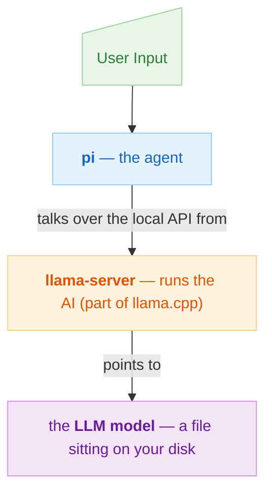

# Local LLM Setup - Mac Edition <!-- omit from toc -->

This repo contains scripts and resources to setup local LLMs and AI. *It is geared towards a broad audience - any one who knows how to use a computer through to a SWE.*

**Use AI freely - Your terms, your rules, no account, no API key, no subscription, and none of your informationis sent to anybody else's computers.**

## Table of Contents <!-- omit from toc -->

- [1. Quick Start](#1-quick-start)
- [2. What's installed](#2-whats-installed)
- [3. Requirements](#3-requirements)
- [4. Model Choices](#4-model-choices)
- [5. Usage](#5-usage)
- [6. Uninstallation](#6-uninstallation)
- [7. Manual Installation](#7-manual-installation)
- [8. Additional Info](#8-additional-info)
- [Glossary](#glossary)

**Reading guide.** Sections 1–5 are for everyone and assume no technical background. Sections 6–8 are the detail an engineer would want before running this on their machine. You do not need the second half to use the script.

## 1. Quick Start

The easiest method is to run the setup script as follows that sets up everything for you.

To run the script, there are two options:

1. Run it directly by copy/pasting this into your terminal:

```bash
bash -c "$(curl -fsSL https://raw.githubusercontent.com/rosmur/local-llm-setup/main/setup-local-pi.sh)"
```

1. Or download the script first and then run it: <https://github.com/rosmur/local-llm-setup/blob/main/setup-local-pi.sh>. And then run it by typing:

```bash
bash Downloads/setup-local-pi.sh
```

*It is written to be readable and to ask before it does anything. Every step explains what it is about to do, shows the exact command, and waits for you to type `y`. Typing anything else skips that step. `Ctrl-C` quits at any point. Alternatively, if you prefer to do the setup manually or step by step see the [manual installation section](#7-manual-installation).*

### NOTE <!-- omit from toc -->

- Written by AI
- Tested and verified operation on MacBook Pro M1 (Sequoia)
- Reviewed by human
- **Re-running the script is always safe.** Every step detects work that is already done and skips it, so an interrupted run — a dropped connection during the download, a closed laptop lid — is recovered by just starting again. The menu marks which models you already have, and nothing is downloaded twice.

---

## 2. What's installed

Four pieces, installed in order, each one needed by the next:

| Piece | What it is | Why it's here |
| --- | --- | --- |
| **Homebrew** | A "app store for the command line" that macOS doesn't ship with | It's how the next piece gets installed |
| **llama.cpp** | Software that runs AI models on your own hardware | This is the engine |
| **A model** | The AI itself — a multi-gigabyte file you choose from a menu | This is the brain |
| **pi** | A coding assistant that lives in your terminal | This is the part you talk to |

This arrangement is minimal. `llama.cpp` runs a small local web server on your machine that speaks the same language as commercial AI services (i.e. OpenaAI API Compatible). `pi` is then pointed at that local server instead of at the internet. `pi` never knows the difference — and neither does your data, which never leaves the machine. Thus they hook up to each other as follows:



<details>
<summary><strong>Exactly what gets installed and where</strong></summary>

Nothing here is hidden; this is the full list of changes to your machine.

| Path | What | Created by |
| --- | --- | --- |
| `/opt/homebrew` (Apple Silicon) or `/usr/local` (Intel) | Homebrew and everything it installs | Homebrew's own installer |
| `<brew prefix>/bin/llama-server`, `llama-cli` | The inference engine | `brew install llama.cpp` |
| `~/.cache/huggingface/hub/` | Downloaded model weights (the big files) | `llama-cli` / `llama-server` |
| `~/bin/llama-serve-<alias>.sh` | The launcher script for your model | This script |
| `~/.pi/agent/models.json` | Tells `pi` where your local server is | This script |
| `~/.pi/agent/models.json.bak.<timestamp>` | Backup, only if the file already existed | This script |
| npm's global prefix, **or** `~/.local` | The `pi` program itself | pi's installer |
| `~/.local/share/pi-node/` | A private copy of Node.js, **only** if you have no Homebrew and no suitable Node | pi's installer |
| Your `.zshrc` / `.bashrc` / `config.fish` | One appended `export PATH=...` line | pi's installer, **and only after asking you** |

**Not touched:** system files, login items, launch agents, browser data, SSH keys, credentials. Nothing runs at startup. Nothing phones home.

</details>

---

## 3. Requirements

- **A Mac.** The script refuses to run on anything else.
- **Disk space.** Between 5 GB and 20 GB depending on which model you pick.
- **Memory (RAM).** This is the one that actually matters. The script prints how much your Mac has and shows the download size of each option next to it. As a rough rule, the model should be comfortably smaller than your RAM. Choosing a model that's too big won't break anything, but it will be painfully slow.
- **Patience for one step.** The model download is several gigabytes. It can take anywhere from a few minutes to over an hour.
- **An internet connection** — but only during setup. Afterwards, the assistant works offline.

Then read each prompt and answer `y` or `n`. That's the whole thing.

## 4. Model Choices

Step 3 offers three options. All are free and open-weight. These are the best overall models *targeted for RAM <32GB*  available as of this writing (July 2026) with relatively large user validation and maturity.

| | Model | Download | Notes |
| --- | --- | --- | --- |
| **1** | Gemma 4 E4B | ~4.6 GB | The small, fast one. Works on modest machines. A reasonable first choice if you're unsure. |
| **2** | Gemma 4 26B-A4B (QAT) | ~15 GB | Much more capable, but only activates a small slice of itself per word, so it stays fast. Wants ~24 GB of RAM. |
| **3** | Qwen3.5 35B-A3B | ~20 GB | Same idea, different family. Strong at code. Wants ~32 GB of RAM. |

If you pick wrong, nothing is lost. Re-run the script and choose a different one; both models stay cached on disk and the script will simply point `pi` at whichever you chose most recently.

If you wish to use a more powerful model (if you have more RAM) or just want to explore, there are literally 1000s of options available. The best place to find them is [huggingface.co](huggingface.co)

## 5. Usage

You need **two terminal windows**, because the engine has to keep running while you work.

**Window 1** — start the engine and leave it alone:

```bash
~/bin/llama-serve-<model-name>.sh
```

(The script tells you the exact filename when it finishes.) The first run may pause a while as the model loads into memory.

**Window 2** — go to whatever folder you want help with, and start the assistant:

```bash
cd ~/my-project
pi
```

Inside `pi`, press **Ctrl+L** (or type `/model`) and select your local model from the list.

When you're done, close window 2, then press `Ctrl-C` in window 1 to shut the engine down and free up your memory.

> **A word of caution about coding assistants generally.** `pi` can read your files, write to them, and run commands on your Mac. That is what makes it useful, and it is also a real risk — a confused model can delete or overwrite things. Use it in folders tracked by version control (`git`), so any mistake can be undone. This applies to every tool of this kind, not just this one.

## 6. Uninstallation

Run the following commands to uninstall/remove everything that was setup

```bash
npm uninstall -g @earendil-works/pi-coding-agent   # remove pi
brew uninstall llama.cpp                          # remove the engine
rm -rf ~/.cache/huggingface/hub                    # reclaim the model files (the big one)
rm -rf ~/.cache/llama.cpp                          # older llama.cpp builds cached here instead
rm -rf ~/.pi                                       # remove pi's config and saved sessions
rm ~/bin/llama-serve-*.sh                          # remove the launcher
```

Homebrew itself is left in place, since you may have other things depending on it.

## 7. Manual Installation

Manual installation is recommended if you:

- Are familiar with the terminal, bash, config files etc.
- Wish to install only a subset of items
- Want to make modifications not supported by the script like alternate models, usage of docker etc.

See [here for step by step installation instructions](docs/script-manual.md)

## 8. Additional Info

| Doc | Description |
| ------ | -------- |
| [Troubleshooting](docs/TROUBLESHOOTING.md) | Common issues and gotchas, along with known gaps/caveats |
| [Legacy Instructions](https://gist.github.com/rosmur/84f0a77404bd901263de26566ab06f08) | Previous version |

## Glossary

- **QAT**: Quantization aware training - means the model was *trained* to survive being compressed, so it loses less quality than ordinary compression would cost.
- **MoE**: Mixture of Experts
