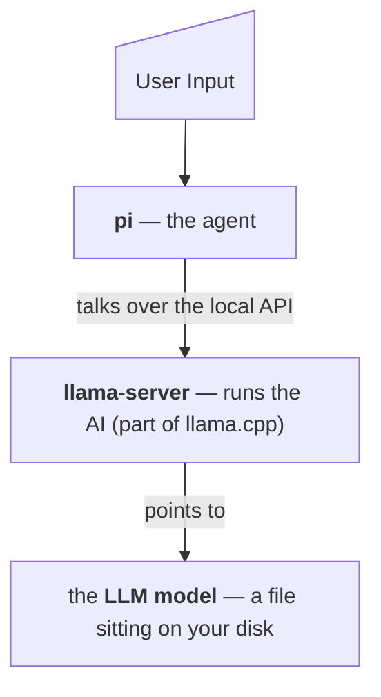

# Local LLM Setup - Mac Edition <!-- omit from toc -->

[](https://rosmur.github.io/local-llm-setup/)

This repo contains scripts and resources to setup local LLMs and AI. It is geared towards a broad audience — anyone who knows how to use a computer through to a SWE.

**Use AI freely - Your terms, your rules, no account, no API key, no subscription, and none of your information is sent to anybody else's computers.**

## Table of Contents <!-- omit from toc -->

- [1. Quick Start](#1-quick-start)
- [2. What's installed](#2-whats-installed)
- [3. Requirements](#3-requirements)
- [4. Model Choices](#4-model-choices)
- [5. Usage](#5-usage)
- [6. Uninstallation](#6-uninstallation)
- [7. Manual Installation](#7-manual-installation)
- [8. Additional Info](#8-additional-info)
- [Glossary](#glossary)


**Reading guide.** Sections 1–5 are for everyone and assume no technical background. Sections 6–8 are the detail an engineer would want before running this on their machine. You do not need the second half to use the script.

## 1. Quick Start

The easiest method is to run the setup script that sets up everything for you.

### Option 1 — Run directly

Copy and paste this into your terminal:

```bash
bash -c "$(curl -fsSL https://raw.githubusercontent.com/rosmur/local-llm-setup/main/setup-local-pi.sh)"
```

### Option 2 — Download first

Download the script from [github.com/rosmur/local-llm-setup](https://github.com/rosmur/local-llm-setup/blob/main/setup-local-pi.sh), then run it:

```bash
bash Downloads/setup-local-pi.sh
```

### What to expect

The script is written to be readable and to ask before it does anything. Every step explains what it is about to do, shows the exact command, and waits for you to type `y`. Typing anything else skips that step. `Ctrl-C` quits at any point.

> **Note.** - Written by AI
> - Tested and verified operation on MacBook Pro M1 (Sequoia)
> - Reviewed by human
> - **Re-running the script is always safe.** Every step detects work that is already done and skips it. An interrupted run — a dropped connection, a closed laptop lid — is recovered by just starting again. The menu marks which models you already have, and nothing is downloaded twice.

### What happens step by step

1. **Homebrew** — Installed if missing (with your permission)
2. **llama.cpp** — Installed via Homebrew
3. **Model** — You pick from a menu of open-weight models
4. **pi** — The coding assistant is installed
5. **Launcher** — A startup script is written to `~/bin/`
6. **Configuration** — `pi` is pointed at your local server

### After the script finishes

See the [Usage](#5-usage) page for how to start the engine and use `pi`.


---

## 2. What's installed

Four pieces, installed in order, each one needed by the next:

| Piece | What it is | Why it's here |
|---|---|---|
| **Homebrew** | A "app store for the command line" that macOS doesn't ship with | It's how the next piece gets installed |
| **llama.cpp** | Software that runs AI models on your own hardware | This is the engine |
| **A model** | The AI itself — a multi-gigabyte file you choose from a menu | This is the brain |
| **pi** | A coding assistant that lives in your terminal | This is the part you talk to |

### How they connect



### Exact paths and files

-   **Homebrew** — `/opt/homebrew` (Apple Silicon) or `/usr/local` (Intel)
-   **llama.cpp binaries** — `<brew prefix>/bin/llama-server`, `llama-cli`
-   **Model weights** — `~/.cache/huggingface/hub/`
-   **Launcher script** — `~/bin/llama-serve-<alias>.sh`
-   **pi config** — `~/.pi/agent/models.json`
-   **pi program** — npm's global prefix, or `~/.local`
-   **Private Node.js** — `~/.local/share/pi-node/` (only if no Homebrew or suitable Node)
-   **Shell profile** — one appended `export PATH=...` line (only after asking you)

#### Not touched

System files, login items, launch agents, browser data, SSH keys, credentials. Nothing runs at startup. Nothing phones home.


---

## 3. Requirements

- **A Mac.** The script refuses to run on anything else.
- **Disk space.** Between 5 GB and 20 GB depending on which model you pick.
- **Memory (RAM).** This is the one that actually matters. The script prints how much your Mac has and shows the download size of each option next to it. As a rough rule, the model should be comfortably smaller than your RAM. Choosing a model that's too big won't break anything, but it will be painfully slow.
- **Patience for one step.** The model download is several gigabytes. It can take anywhere from a few minutes to over an hour.
- **An internet connection** — but only during setup. Afterwards, the assistant works offline.

Then read each prompt and answer `y` or `n`. That's the whole thing.


---

## 4. Model Choices

Step 3 of the setup script offers three options. All are free and open-weight. These are the best overall models *targeted for RAM <32 GB* available as of July 2026 with relatively large user validation and maturity.

|   | Model | Download | Notes |
|---|---|---|---|
| **1** | Gemma 4 E4B | ~4.6 GB | The small, fast one. Works on modest machines. A reasonable first choice if you're unsure. |
| **2** | Gemma 4 26B-A4B (QAT) | ~15 GB | Much more capable, but only activates a small slice of itself per word, so it stays fast. Wants ~24 GB of RAM. |
| **3** | Qwen3.5 35B-A3B | ~20 GB | Same idea, different family. Strong at code. Wants ~32 GB of RAM. |

If you pick wrong, nothing is lost. Re-run the script and choose a different one; both models stay cached on disk and the script will simply point `pi` at whichever you chose most recently.

> **Exploring other models.** If you wish to use a more powerful model (if you have more RAM) or just want to explore, there are literally 1000s of options available. The best place to find them is [huggingface.co](https://huggingface.co).


---

## 5. Usage

You need **two terminal windows**, because the engine has to keep running while you work.

### Window 1 — Start the engine

Start the engine and leave it running:

```bash
~/bin/llama-serve-<model-name>.sh
```

(The script tells you the exact filename when it finishes.) The first run may pause a while as the model loads into memory.

### Window 2 — Start the assistant

Go to whatever folder you want help with, and start the assistant:

```bash
cd ~/my-project
pi
```

Inside `pi`, press **Ctrl+L** (or type `/model`) and select your local model from the list.

### When you're done

Close window 2, then press `Ctrl-C` in window 1 to shut the engine down and free up your memory.

> **A word of caution about coding assistants generally.** `pi` can read your files, write to them, and run commands on your Mac. That is what makes it useful, and it is also a real risk — a confused model can delete or overwrite things. Use it in folders tracked by version control (`git`), so any mistake can be undone. This applies to every tool of this kind, not just this one.


---

## 6. Uninstallation

Run the following commands to uninstall/remove everything that was set up:

```bash
npm uninstall -g @earendil-works/pi-coding-agent   # remove pi
brew uninstall llama.cpp                          # remove the engine
rm -rf ~/.cache/huggingface/hub                    # reclaim the model files (the big one)
rm -rf ~/.cache/llama.cpp                          # older llama.cpp builds cached here instead
rm -rf ~/.pi                                       # remove pi's config and saved sessions
rm ~/bin/llama-serve-*.sh                          # remove the launcher
```

Homebrew itself is left in place, since you may have other things depending on it.


---

## 7. Manual Installation

Manual installation is recommended if you:

- Are familiar with the terminal, bash, config files etc.
- Wish to install only a subset of items
- Want to make modifications not supported by the script like alternate models, usage of docker etc.

See [here for step by step installation instructions](docs/script-manual.md)

---

## 8. Additional Info

| Doc | Description |
| ------ | -------- |
| [Troubleshooting](docs/TROUBLESHOOTING.md) | Common issues and gotchas, along with known gaps/caveats |
| [Legacy Instructions](https://gist.github.com/rosmur/84f0a77404bd901263de26566ab06f08) | Previous version |

---

## Glossary

**QAT**
:   Quantization Aware Training — means the model was *trained* to survive being compressed, so it loses less quality than ordinary compression would cost.

**MoE**
:   Mixture of Experts — a model architecture where only a subset of parameters activate for any given input, allowing much larger total model size while keeping inference fast.

