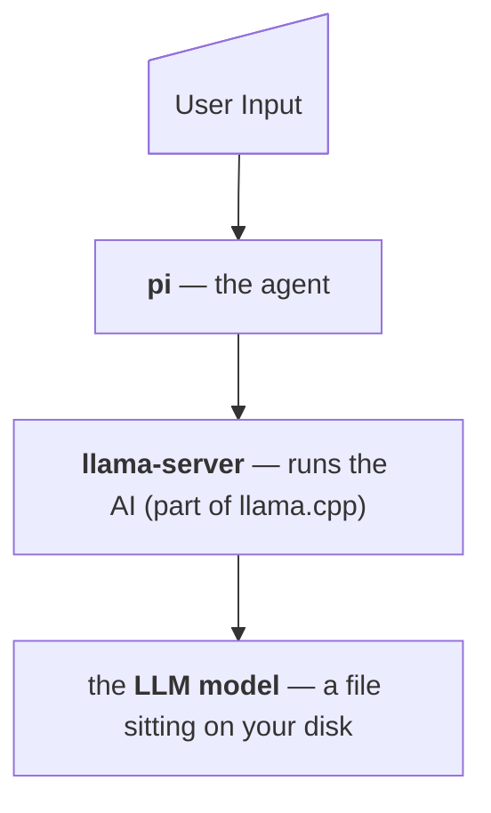

# Local LLM Setup — Mac Edition

This repo contains scripts and resources to setup local LLMs and AI. It is geared towards a broad audience — anyone who knows how to use a computer through to a SWE.

**Use AI freely — Your terms, your rules, no account, no API key, no subscription, and none of your information is sent to anybody else's computers.**

## Reading Guide

Sections 1–5 are for everyone and assume no technical background. Sections 6–8 are the detail an engineer would want before running this on their machine. You do not need the second half to use the script.

## What this sets up

Four pieces, installed in order, each one needed by the next:

| Piece | What it is |
|---|---|
| **Homebrew** | A "app store for the command line" that macOS doesn't ship with |
| **llama.cpp** | Software that runs AI models on your own hardware |
| **A model** | The AI itself — a multi-gigabyte file you choose from a menu |
| **pi** | A coding assistant that lives in your terminal |

This arrangement is minimal. `llama.cpp` runs a small local web server on your machine that speaks the same language as commercial AI services (OpenAI API compatible). `pi` is then pointed at that local server instead of at the internet. `pi` never knows the difference — and neither does your data, which never leaves the machine.

## Getting Started

👉 [**Quick Start →**](quick-start.md)

Run a single script and you're done. Everything is automated, prompts you before making changes, and is safe to re-run.
