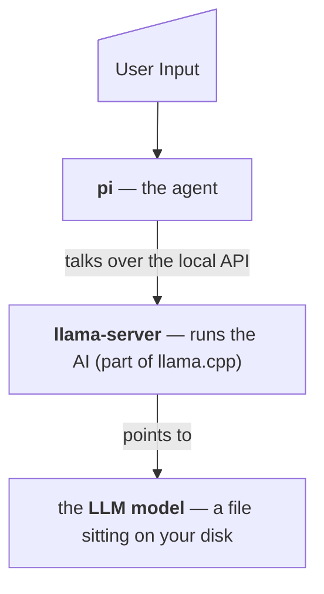

# What's installed

Four pieces, installed in order, each one needed by the next:

| Piece | What it is | Why it's here |
|---|---|---|
| **Homebrew** | A "app store for the command line" that macOS doesn't ship with | It's how the next piece gets installed |
| **llama.cpp** | Software that runs AI models on your own hardware | This is the engine |
| **A model** | The AI itself — a multi-gigabyte file you choose from a menu | This is the brain |
| **pi** | A coding assistant that lives in your terminal | This is the part you talk to |

## How they connect

## Exact paths and files

-   **Homebrew** — `/opt/homebrew` (Apple Silicon) or `/usr/local` (Intel)
-   **llama.cpp binaries** — `<brew prefix>/bin/llama-server`, `llama-cli`
-   **Model weights** — `~/.cache/huggingface/hub/`
-   **Launcher script** — `~/bin/llama-serve-<alias>.sh`
-   **pi config** — `~/.pi/agent/models.json`
-   **pi program** — npm's global prefix, or `~/.local`
-   **Private Node.js** — `~/.local/share/pi-node/` (only if no Homebrew or suitable Node)
-   **Shell profile** — one appended `export PATH=...` line (only after asking you)

### Not touched

System files, login items, launch agents, browser data, SSH keys, credentials. Nothing runs at startup. Nothing phones home.
