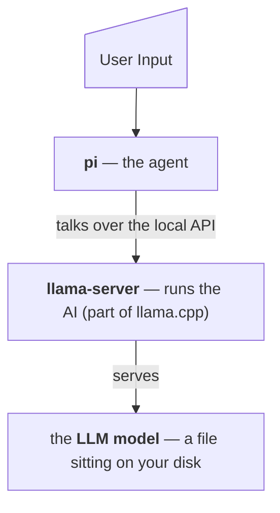

# What's installed

Four pieces, installed in order, each one needed by the next:

| Piece | What it is | Why it's here |
|---|---|---|
| **llama.cpp** | Software that runs AI models on your own hardware | This is the engine |
| **A model** | The AI itself — a multi-gigabyte file you choose from a menu | This is the brain |
| **pi** | A coding assistant that lives in your terminal | This is the part you talk to |
| **pi-llama plugin** | Connects pi to the model served by `llama serve` | This is the wiring — no manual config needed |

On macOS, llama.cpp is installed via Homebrew (or the official direct installer); on Linux and Windows it uses the official direct installer. There is no separate Homebrew step anymore.

## How they connect

## Exact paths and files

::: grids
    ::: grid
        ::: card "llama.cpp" icon:boxes
        Homebrew (`<brew prefix>/bin/llama-server`, `llama-cli`) on macOS, or the official direct installer (`~/.local/bin`, `~/.local/share/llama.cpp`) elsewhere.
        :::
    :::
    ::: grid
        ::: card "Model weights" icon:database
        `~/.cache/huggingface/hub/`
        :::
    :::
    ::: grid
        ::: card "pi-llama plugin" icon:plug
        Managed by pi; no manual config file.
        :::
    :::
    ::: grid
        ::: card "pi program" icon:terminal
        npm's global prefix, or `~/.local`.
        :::
    :::
    ::: grid
        ::: card "Private Node.js" icon:node
        `~/.local/share/pi-node/` (only if no suitable Node).
        :::
    :::
    ::: grid
        ::: card "Shell profile" icon:file
        One appended `export PATH=...` line (only after asking you).
        :::
    :::
:::

### Not touched

System files, login items, launch agents, browser data, SSH keys, credentials. Nothing runs at startup. Nothing phones home.
